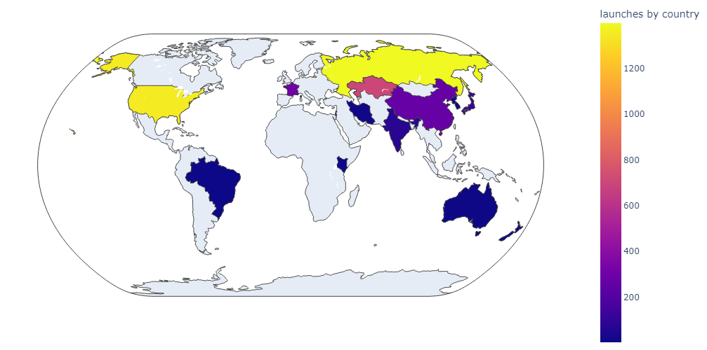
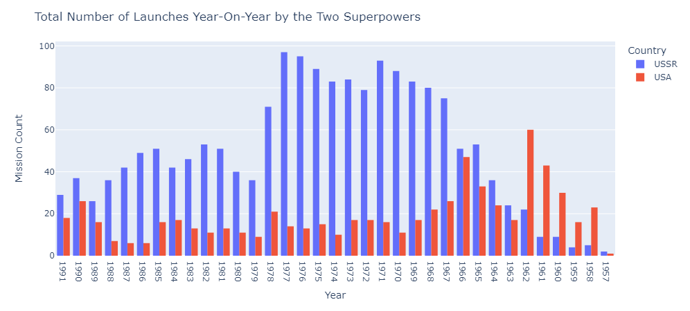
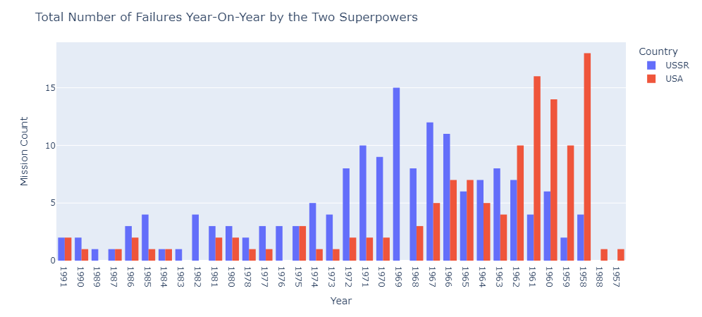

# Análise Exploratória de Dados (EDA) sobre a Corrida Espacial e Lançamentos de Foguetes

## Descrição

Este repositório contém uma Análise Exploratória de Dados (EDA) sobre a corrida espacial e lançamentos de foguetes. A análise tem como objetivo explorar os dados históricos de lançamentos espaciais, identificar padrões e tendências ao longo do tempo, e fornecer insights sobre os principais eventos e marcos da exploração espacial.

## Objetivos

- Explorar a distribuição dos lançamentos espaciais por ano, país e agência espacial.
- Identificar tendências e padrões ao longo das décadas.
- Analisar o sucesso e falhas dos lançamentos de foguetes.
- Investigar as características dos foguetes e suas missões.
- Gerar visualizações que facilitem a interpretação dos dados históricos da corrida espacial.

## Conteúdo do Repositório

- `data/`: Contém os conjuntos de dados utilizados na análise.
- `notebooks/`: Notebooks Jupyter com as etapas da análise exploratória.
- `README.md`: Este arquivo, com informações sobre o projeto.

## Ferramentas Utilizadas

- Python
- Pandas
- Matplotlib
- Seaborn
- Plotly
- Jupyter Notebook

## Resultados

A Análise Exploratória de Dados (EDA) sobre a corrida espacial e lançamentos de foguetes revelou padrões interessantes e insights valiosos. Observamos uma intensa atividade de lançamentos durante os anos 1960 e 1970, impulsionada pela competição entre os Estados Unidos e a União Soviética, que culminou com o pouso do homem na Lua em 1969. Ao longo das décadas, a análise destacou a diversificação dos países e agências espaciais envolvidas em lançamentos, com um aumento significativo nas missões comerciais e privadas nas últimas duas décadas. Além disso, identificamos tendências de melhoria na taxa de sucesso dos lançamentos, refletindo avanços tecnológicos e maior experiência no campo. As visualizações geradas ilustram claramente essas tendências e fornecem uma compreensão mais profunda da evolução da exploração espacial.

- Alguns resultados obtidos;

- Total de lançamentos por país

  

- Número total de lançamentos ano após ano de USSR x USA.

  

- Números de Falhas nos lançamentos.

  

